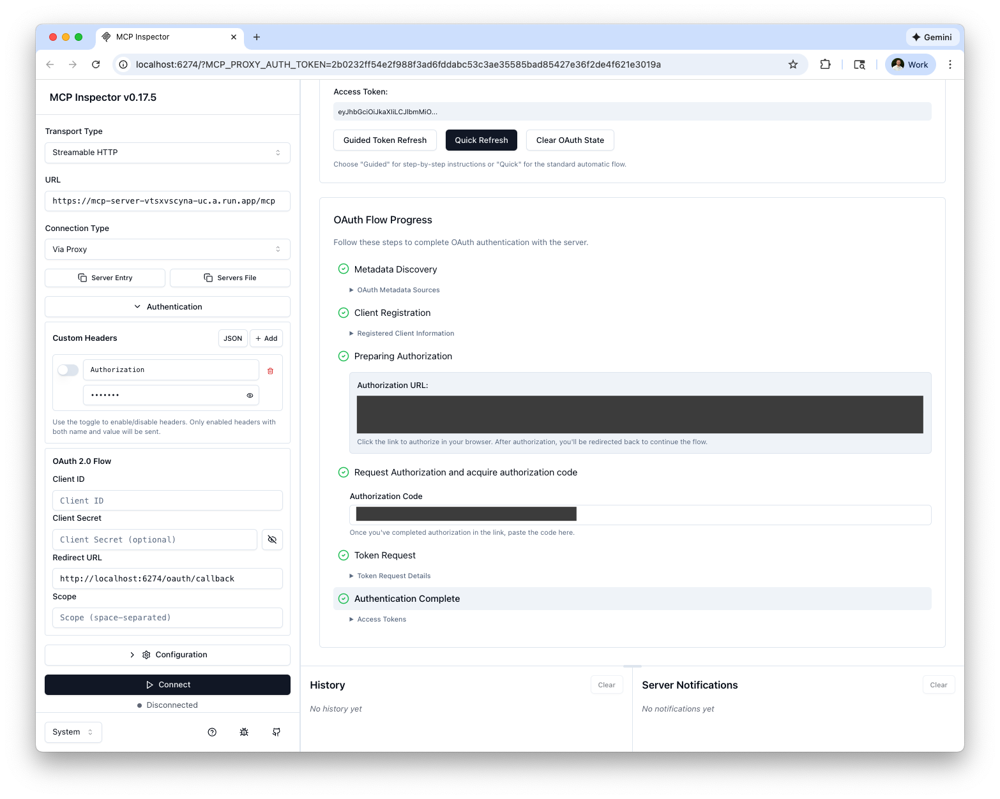

# Production Deployment Guide

This guide covers deploying your FastMCP server with Auth0 authentication to production using Google Cloud Run.

## Architecture Overview

The FastMCP server is deployed as a single containerized service on Google Cloud Run:

- **FastMCP Server**: Python MCP server with Auth0 authentication (Starlette + FastMCP)

### Deployment Flow

1. **Configure Environment** - Set up `.env.production` with your Auth0 credentials
2. **Deploy to Cloud Run** - Build and deploy the container
3. **Update MCP Server URL** - Configure the deployed URL in your environment
4. **Connect MCP Clients** - Configure your MCP clients to use the deployed server

## Prerequisites

### Required Accounts
- [Google Cloud Platform](https://console.cloud.google.com/) account with billing enabled
- [Auth0](https://auth0.com/) account with an API configured

### Required Tools
- [gcloud CLI](https://cloud.google.com/sdk/docs/install) installed and configured

### Enable Google Cloud APIs

```bash
# Set your project ID
gcloud config set project your-project-id

# Enable required APIs
gcloud services enable cloudbuild.googleapis.com
gcloud services enable run.googleapis.com
gcloud services enable containerregistry.googleapis.com
```

## Deployment Steps

### Step 1: Configure Production Environment

Create your production environment file:

```bash
# Copy the example file
cp .env.example .env.production
```

Edit `.env.production` with your credentials:

```bash
# Google Cloud Platform
GCP_PROJECT_ID="your-project-id"
GCP_REGION="us-central1"
SERVICE_NAME=mcp-server

# Auth0 Configuration
AUTH0_DOMAIN="your-tenant.auth0.com"
AUTH0_AUDIENCE="your-api-identifier"

# MCP Server Configuration (will be updated after deployment)
MCP_SERVER_URL="http://localhost:3001"

# Server Configuration
PORT=3001
DEBUG=false

# CORS Configuration (update with your client origins)
CORS_ORIGINS=*
```

### Step 2: Deploy FastMCP Server

```bash
# Make script executable (first time only)
chmod +x scripts/deploy-mcp-server.sh

# Run deployment
./scripts/deploy-mcp-server.sh
```

The script will:
1. Build a Docker image with your MCP server
2. Push it to Google Container Registry
3. Deploy it to Cloud Run
4. Output the service URL

#### Save the MCP Server URL

After deployment completes, you'll see:
```
MCP Server URL: https://mcp-server-xxx-uc.a.run.app
```

**Update `.env.production` with this URL:**
```bash
MCP_SERVER_URL="https://mcp-server-xxx-uc.a.run.app"
```

**Important:** you'll also want to create a new Resource Server in Auth0 to use for your production `AUTH0_AUDIENCE`.
```
auth0 api post resource-servers --data '{
  "identifier": "https://mcp-server-xxx-uc.a.run.app/",  # use your Production deployed URL
  "name": "MCP Tools API",
  "signing_alg": "RS256",
  "token_dialect": "rfc9068_profile_authz",
  "enforce_policies": true,
  "scopes": [
    {"value": "tool:whoami", "description": "Access the WhoAmI tool"},
    {"value": "tool:greet", "description": "Access the Greeting tool"}
  ]
}'
```

**Update `.env.production` with this URL:**
```bash
AUTH0_AUDIENCE="https://mcp-server-xxx-uc.a.run.app/"
```

### Step 3: Redeploy with Updated URL (Optional)

If you want the server to know its own URL for OAuth metadata:

```bash
./scripts/deploy-mcp-server.sh
```

## Connecting MCP Clients

### Using MCP Inspector

```bash
npx @modelcontextprotocol/inspector
```

In the MCP Inspector:
- **Transport Type**: Streamable HTTP
- **URL**: `https://mcp-server-xxx-uc.a.run.app/mcp`
- **Connection Type**: Via Proxy

Open the the Auth Settings, and use the Quick OAuth flow to acquire an access token.



After, ensure this access token is provided in your **Authentication** headers before hitting the **Connect** button. Now you should be to interface with your MCP Server using MCP Inspector.

### Using cURL

```bash
# Check server status - test OAuth resource metadata
curl -v https://mcp-server-xxx-uc.a.run.app/.well-known/oauth-protected-resource

# List available tools (requires valid Auth0 access token)
curl -X POST https://mcp-server-xxx-uc.a.run.app/mcp \
  -H "Content-Type: application/json" \
  -H "Accept: application/json, text/event-stream" \
  -H "Authorization: Bearer YOUR_ACCESS_TOKEN" \
  -d '{"jsonrpc": "2.0", "id": 1, "method": "tools/list"}'

# Call get_datetime tool (requires Auth0 access token, but no specific scopes)
curl -X POST https://mcp-server-xxx-uc.a.run.app/mcp \
  -H "Content-Type: application/json" \
  -H "Accept: application/json, text/event-stream" \
  -H "Authorization: Bearer YOUR_ACCESS_TOKEN" \
  -d '{"jsonrpc": "2.0", "id": 2, "method": "tools/call", "params": {"name": "get_datetime", "arguments": {}}}'

# Call whoami tool (requires Auth0 access token with tool:whoami scope)
curl -X POST https://mcp-server-xxx-uc.a.run.app/mcp \
  -H "Content-Type: application/json" \
  -H "Accept: application/json, text/event-stream" \
  -H "Authorization: Bearer YOUR_ACCESS_TOKEN" \
  -d '{"jsonrpc": "2.0", "id": 3, "method": "tools/call", "params": {"name": "whoami", "arguments": {}}}'

# Call greet tool (requires Auth0 access token with tool:greet scope)
curl -X POST https://mcp-server-xxx-uc.a.run.app/mcp \
  -H "Content-Type: application/json" \
  -H "Accept: application/json, text/event-stream" \
  -H "Authorization: Bearer YOUR_ACCESS_TOKEN" \
  -d '{"jsonrpc": "2.0", "id": 4, "method": "tools/call", "params": {"name": "greet", "arguments": {"name": "World"}}}'
```

**Note:** Replace `YOUR_ACCESS_TOKEN` with a valid Auth0 access token. See the README.md for instructions on creating a test application and acquiring an access token, or use an access token acquired from MCP Inspector.

## Verification

### Test Your Deployment

1. **Check OAuth metadata endpoint:**
   ```bash
   curl https://mcp-server-xxx-uc.a.run.app/.well-known/oauth-protected-resource
   ```

2. **Test with MCP Inspector** using a valid Auth0 access token

### Check Service Health

```bash
# View service status
gcloud run services describe mcp-server --region us-central1

# Check logs
gcloud run services logs mcp-server --region us-central1 --limit 50
```

## Monitoring and Logs

### View Logs

```bash
# View recent logs
gcloud run services logs mcp-server --region $GCP_REGION --limit 50

# Stream logs in real-time
gcloud run services logs mcp-server --region $GCP_REGION --follow

# View logs in Cloud Console
gcloud logging read "resource.type=cloud_run_revision AND resource.labels.service_name=mcp-server" --limit 50
```

### View Metrics

Visit Cloud Console:
- https://console.cloud.google.com/run/detail/$GCP_REGION/mcp-server/metrics

## Cost Optimization

Cloud Run pricing is based on:
- **CPU**: Only charged when handling requests
- **Memory**: Only charged when handling requests
- **Requests**: $0.40 per million requests
- **Free tier**: 2 million requests/month, 360,000 GB-seconds/month

### Tips to Reduce Costs

1. **Set appropriate resource limits:**
   ```bash
   --memory 512Mi    # Sufficient for most MCP workloads
   --cpu 1           # Sufficient for most workloads
   ```

2. **Limit maximum instances:**
   ```bash
   --max-instances 10  # Prevent runaway scaling
   ```

3. **Set minimum instances to 0:**
   ```bash
   --min-instances 0  # Scale to zero when idle (default)
   ```

4. **Use appropriate timeouts:**
   ```bash
   --timeout 300  # 5 minutes for MCP operations
   ```

## Troubleshooting

### Container Fails to Start

**Check logs:**
```bash
gcloud run services logs mcp-server --limit 50
```

**Common issues:**
- Missing environment variables (AUTH0_DOMAIN, AUTH0_AUDIENCE)
- Port mismatch (Dockerfile EXPOSE should match --port)
- Insufficient memory/CPU

**Solution:**
```bash
# Increase resources if needed
gcloud run services update mcp-server \
  --memory 1Gi \
  --cpu 2
```

### Authentication Errors

**Verify Auth0 configuration:**
- AUTH0_DOMAIN is correct (e.g., `your-tenant.auth0.com`)
- AUTH0_AUDIENCE matches your Auth0 API identifier
- Access token has required scopes (`tool:greet`, `tool:whoami`)

**Check server logs:**
```bash
gcloud run services logs mcp-server --limit 50
```

### High Latency

**Cold start times:**
- Cloud Run instances may take 1-2 seconds to start
- Consider using `--min-instances 1` to keep one warm

**Optimize:**
```bash
# Keep at least one instance running
gcloud run services update mcp-server --min-instances 1
```

### CORS Errors

**Update CORS origins in `.env.production`:**
```bash
CORS_ORIGINS=https://your-client-origin.com,https://another-origin.com
```

Then redeploy:
```bash
./scripts/deploy-mcp-server.sh
```

## Updating Deployments

### Update Code

After making code changes, simply redeploy:

```bash
./scripts/deploy-mcp-server.sh
```

### Update Environment Variables

```bash
# Update single variable
gcloud run services update mcp-server \
  --update-env-vars NEW_VAR=value

# Update multiple variables
gcloud run services update mcp-server \
  --update-env-vars VAR1=value1,VAR2=value2
```

### Rollback to Previous Version

```bash
# List revisions
gcloud run revisions list --service mcp-server

# Rollback to specific revision
gcloud run services update-traffic mcp-server \
  --to-revisions=mcp-server-00001-abc=100
```

## CI/CD Setup (Optional)

### GitHub Actions

Create `.github/workflows/deploy.yml`:

```yaml
name: Deploy to Cloud Run

on:
  push:
    branches: [main]

jobs:
  deploy:
    runs-on: ubuntu-latest
    steps:
      - uses: actions/checkout@v4
      
      - id: auth
        uses: google-github-actions/auth@v2
        with:
          credentials_json: ${{ secrets.GCP_CREDENTIALS }}
      
      - name: Set up Cloud SDK
        uses: google-github-actions/setup-gcloud@v2
      
      - name: Deploy MCP Server
        run: |
          export GCP_PROJECT_ID=${{ secrets.GCP_PROJECT_ID }}
          export GCP_REGION=${{ secrets.GCP_REGION }}
          export AUTH0_DOMAIN=${{ secrets.AUTH0_DOMAIN }}
          export AUTH0_AUDIENCE=${{ secrets.AUTH0_AUDIENCE }}
          export MCP_SERVER_URL=${{ secrets.MCP_SERVER_URL }}
          ./scripts/deploy-mcp-server.sh
```

### Required GitHub Secrets

- `GCP_CREDENTIALS`: Service account JSON key with Cloud Run Admin permissions
- `GCP_PROJECT_ID`: Your Google Cloud project ID
- `GCP_REGION`: Deployment region (e.g., `us-central1`)
- `AUTH0_DOMAIN`: Your Auth0 domain
- `AUTH0_AUDIENCE`: Your Auth0 API identifier
- `MCP_SERVER_URL`: Your deployed MCP server URL

## Getting Help

- [FastMCP Documentation](https://github.com/jlowin/fastmcp)
- [Auth0 Documentation](https://auth0.com/docs)
- [Cloud Run Documentation](https://cloud.google.com/run/docs)
- [GitHub Issues](https://github.com/priley86/auth0-firebase-fastmcp/issues)
