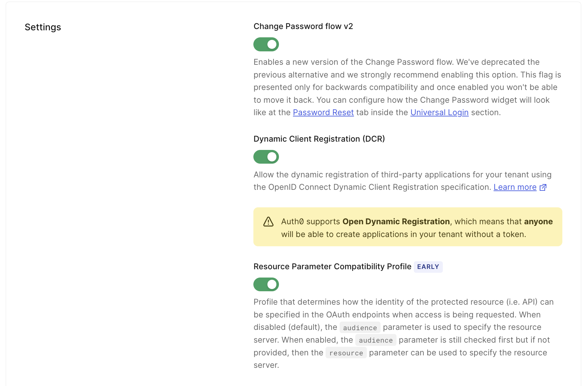
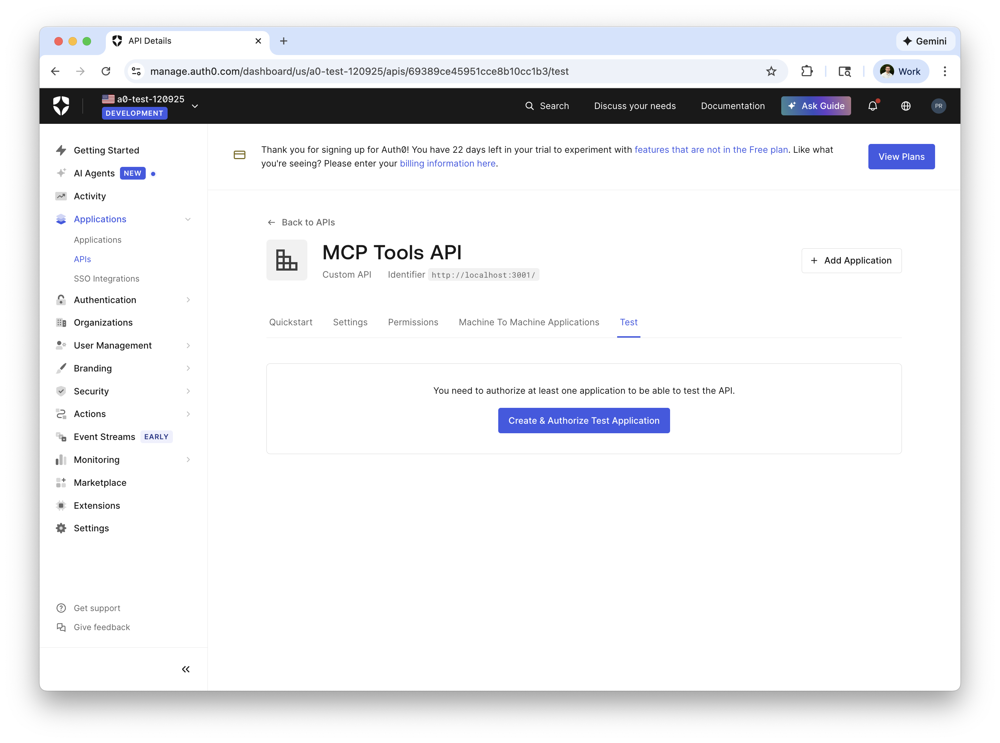
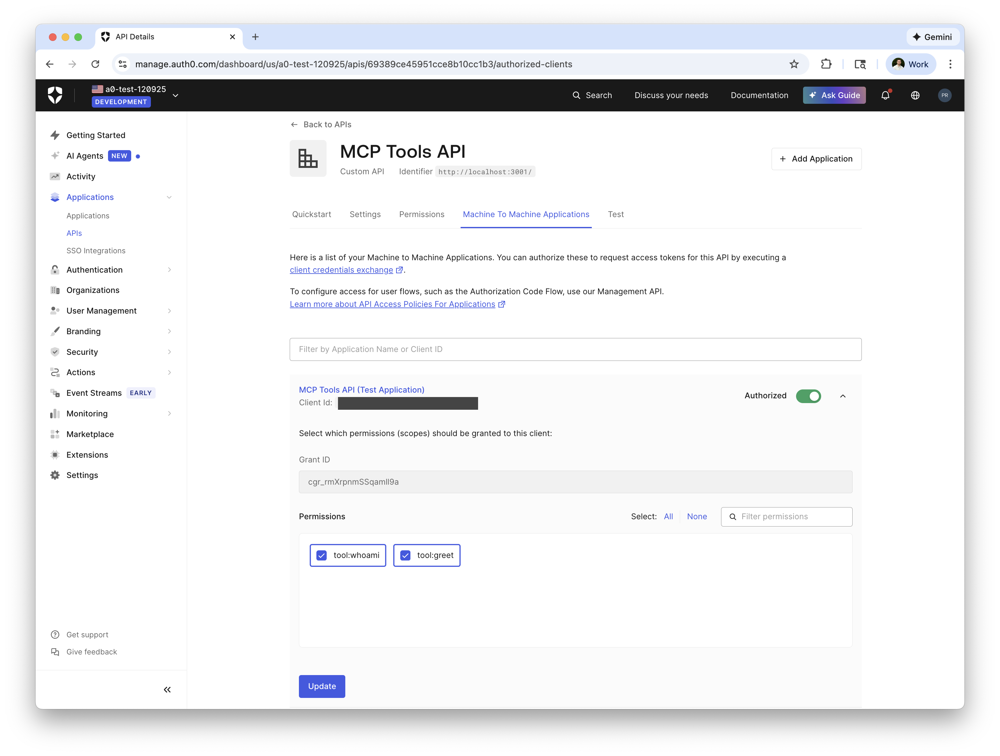
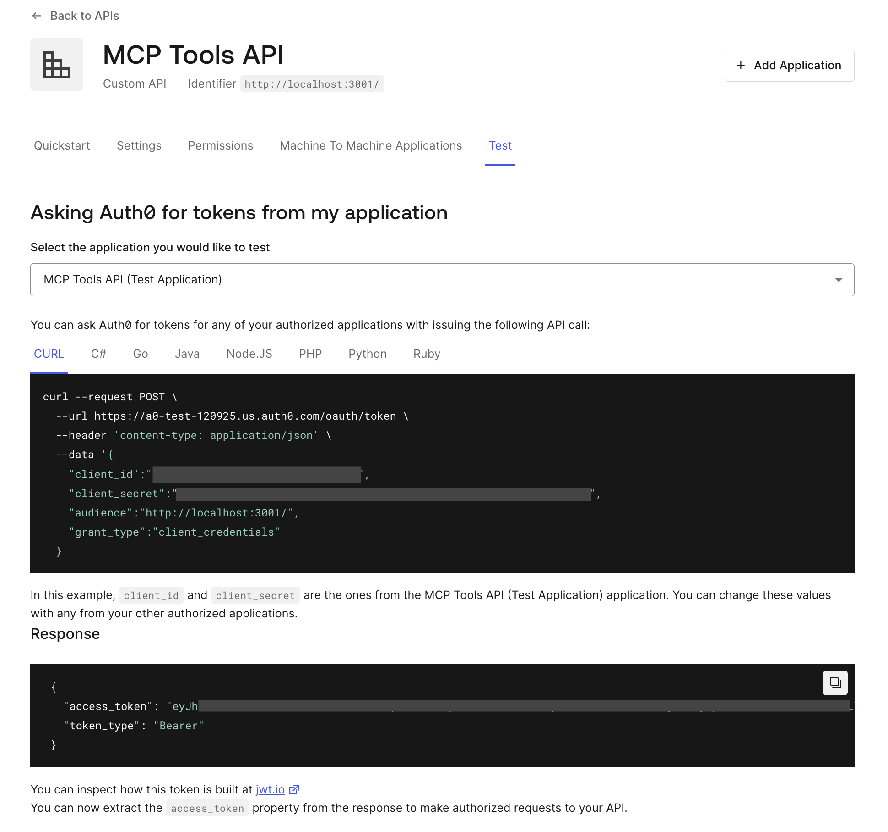

# Auth0 + Firebase + FastMCP MCP Server Starter

This example demonstrates how to create a FastMCP MCP server that uses Auth0 for authentication using the `auth0-api-python` library.

[](https://idx.google.com/new?template=https://github.com/priley86/auth0-firebase-fastmcp)

## Features

- 🔐 **Secure Authentication** with Auth0 OAuth 2.0
- 🚀 **FastMCP** - High-performance MCP server built on Starlette
- 🔧 **Firebase Studio Ready** - Pre-configured for Firebase Studio (Project IDX)
- ☁️ **Cloud Run Deployment** - Production-ready deployment scripts for Google Cloud

## Available Tools

The server exposes the following tools:

- `whoami` - Returns authenticated user information and granted scopes
- `greet` - Personalized greeting demonstrating authenticated tool access
- `get_datetime` - Returns the current UTC date and time (no scope required)

## Quick Start

1. Click the "Open in Firebase Studio" button above
2. Wait for the workspace to initialize (dependencies will be installed automatically)
3. Configure your `.env` file with your Auth0 credentials (see below sections on how to configure this)
4. The MCP server will start automatically! See the Testing section below for instructions on testing in Firebase Studio.

## Auth0 Tenant Setup

Create an [Auth0 account](https://auth0.com/signup?onboard_app=auth_for_aa) to setup an Auth0 tenant if you don't yet have one.

For detailed instructions on setting up your Auth0 tenant for MCP server integration, please refer to the [Auth0 Tenant Setup guide](https://github.com/auth0-samples/auth0-ai-samples/tree/main/auth-for-mcp/fastmcp-mcp-js/README.md#auth0-tenant-setup) in the FastMCP example.

Simplified instructions for this starter:

1. Authenticate with Auth0 CLI:
```
auth0 login --scopes "read:client_grants,create:client_grants,delete:client_grants,read:clients,create:clients,update:clients,read:resource_servers,create:resource_servers,update:resource_servers,read:roles,create:roles,update:roles,update:tenant_settings,read:connections,update:connections"
```
and verify you are using the correct Auth0 tenant after:
```
auth0 tenants list
```

2. Enable Dynamic Client Registration (DCR) and improved user consent experience:
```
auth0 tenant-settings update set flags.enable_dynamic_client_registration flags.use_scope_descriptions_for_consent
```

3. Create an API (Resource Server) for your MCP Server with Auth0
```
auth0 api post resource-servers --data '{
  "identifier": "http://localhost:3001/",
  "name": "MCP Tools API",
  "signing_alg": "RS256",
  "token_dialect": "rfc9068_profile_authz",
  "enforce_policies": true,
  "scopes": [
    {"value": "tool:whoami", "description": "Access the WhoAmI tool"},
    {"value": "tool:greet", "description": "Access the Greeting tool"}
  ]
}'
```

4. Configure RBAC Roles & Permissions

You read further about specifying granular roles and scope access for users in the mention [here](https://github.com/auth0-samples/auth0-ai-samples/blob/main/auth-for-mcp/fastmcp-mcp-js/README.md#step-5-configure-rbac-roles-and-permissions), but you minimally add an Admin role for testing with the following:

```
auth0 roles create --name "Tool Administrator" --description "Grants access to all MCP tools"
```
Note the role ID returned and use it to assign permissions to a role: 
```
auth0 roles permissions add YOUR_ADMIN_ROLE_ID --api-id "http://localhost:3001/" --permissions "tool:whoami,tool:greet"
```
Now assign the admin role to your user:
```
# Find a user's ID
auth0 users search --query "email:\"example@google.com\""

auth0 users roles assign "auth0|USER_ID_HERE" --roles "YOUR_ROLE_ID_HERE"
```

5. Ensure Resource Parameter Compatibility Profile

Ensure you can use `resource` parameters when requesting access tokens for a resource server. This is an **Early** access feature.

Go to your Auth0 tenant **Settings** and navigate to the **Advanced** tab. Make sure to enable the **Resource Parameter Compatibility** Profile setting.



## Configuration

Copy `.env.example` to `.env` and configure the domain and audience:

```
# Auth0 tenant domain
AUTH0_DOMAIN=example-tenant.us.auth0.com

# Auth0 API Identifier
AUTH0_AUDIENCE=http://localhost:3001/
```
**Note:** the `AUTH0_AUDIENCE` should match the `identifier` you used when creating the resource server above. The `AUTH0_DOMAIN` can be found in your tenant settings.

The other settings can remain defaulted if using the Firebase Studio Preview:
```
# URL where this MCP server is accessible (used for OAuth metadata)
MCP_SERVER_URL=http://localhost:3001

# Port the server will listen on
PORT=3001

# Enable debug mode for detailed logging
DEBUG=false

# CORS origins - comma-separated list of allowed origins (* for all)
CORS_ORIGINS=*

# Google Cloud Platform Configuration (for production deployment)
# GCP_PROJECT_ID=your-project-id
# GCP_REGION=us-central1
# SERVICE_NAME=mcp-server
```

## Testing

### Testing in Firebase Studio

For local testing with Firebase Studio, you can visit your Auth0 tenant at [manage.auth0.com](https://manage.auth0.com) to create a test application and acquire an access token for use with your FastMCP Server.

**Note:** this is not required if using a deployed instance. You can test this easily with MCP Inspector using DCR (Dynamic Client Registration).

1. Visit the Applications -> APIs page and select your MCP Tools API.

Within the **Test** tab, use the **Create & Authorize Test Application** button to create a test client.



2. Enable permissions (scopes) for your client.

Within the M2M Applications tab, ensure your MCP Tools API (Test Application) has the `tool:whoami` and `tool:great` permissions. Once enabled, hit the **Update** button and save these permissions.


3. Request an access token.

Lastly, you can request an access token by navigating back to the **Test** tab. Copy the access token in the response.


## Deployment

This project includes production-ready deployment scripts for Google Cloud Run.

See [DEPLOYMENT.md](DEPLOYMENT.md) for detailed instructions on:

- Setting up Google Cloud Platform
- Configuring production environment variables
- Deploying to Cloud Run
- Monitoring and troubleshooting

### Quick Deploy

```bash
# 1. Create production environment file
cp .env.example .env.production

# 2. Edit .env.production with your credentials

# 3. Deploy to Cloud Run
./scripts/deploy-mcp-server.sh
```

## Running Locally

Install dependencies:
```
poetry install
```

With the `.env` configuration file in place, the example can be started by running:

```bash
poetry run python -m src.server
```

## Learn More

- [Auth0 Documentation](https://auth0.com/docs)
- [FastMCP Documentation](https://github.com/jlowin/fastmcp)
- [Firebase Studio Documentation](https://firebase.google.com/docs/studio)
- [Cloud Run Documentation](https://cloud.google.com/run/docs)

## License

This project is based on the [Auth0 AI Samples](https://github.com/auth0-samples/auth0-ai-samples) and is provided under the MIT License.
